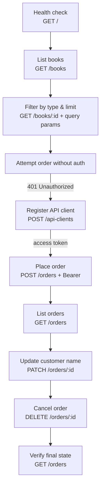

# Book Store API — REST Client Walkthrough

A hands-on tour of consuming a REST API with Python `requests` — covering the full lifecycle from anonymous reads through authenticated create, update, and delete.


Target API: [`simple-books-api.click`](https://simple-books-api.click)

---

## What it demonstrates

The script runs as a narrative — each step builds on the one before, including the deliberate failure that motivates authentication.



**The key beat** is step 4: the order is attempted *before* credentials exist, returning `401`. Only then is a client registered and a bearer token used. Seeing the failure first makes the reason for the token concrete rather than abstract.

---

## Operations covered

| # | Method | Endpoint | Auth | Purpose |
|:--:|---|---|:--:|---|
| 1 | `GET` | `/` | — | API status |
| 2 | `GET` | `/books` | — | List all books |
| 3 | `GET` | `/books/{id}` | — | Single book, with `type` and `limit` query params |
| 4 | `POST` | `/orders` | ❌ | Demonstrates the `401` |
| 5 | `POST` | `/api-clients` | — | Register and receive an access token |
| 6 | `POST` | `/orders` | ✅ | Place an order |
| 7 | `GET` | `/orders` | ✅ | List your orders |
| 8 | `PATCH` | `/orders/{id}` | ✅ | Partially update — change customer name |
| 9 | `DELETE` | `/orders/{id}` | ✅ | Cancel an order |

Authenticated calls send `Authorization: Bearer <ACCESS_TOKEN>`.

---

## Concepts

| Concept | Where it appears |
|---|---|
| **Query parameters** | `params={"type": "fiction", "limit": 2}` passed to `requests.get` |
| **JSON request bodies** | `json=` used instead of `data=`, so headers are set automatically |
| **Bearer authentication** | Token injected via the `Authorization` header |
| **Status-code semantics** | `401` unauthorized, `404` out of stock, `2xx` success |
| **Partial updates** | `PATCH` changes one field rather than replacing the resource |
| **Secrets handling** | Credentials read from the environment via `python-dotenv` |

---

## Getting Started

```bash
git clone https://github.com/rehaannazir/Ordering-Book-_-API-handling.git
cd Ordering-Book-_-API-handling

pip install requests python-dotenv
```

Copy the template to a real `.env` file:

```bash
cp env-tempelate.txt .env
```

```env
BASE_URL=https://simple-books-api.click
ACCESS_TOKEN=your-access-token
```

> **Getting a token:** run the script once — step 5 (`POST /api-clients`) prints an `accessToken` in its JSON response. Paste that into `.env` as `ACCESS_TOKEN`, then re-run so the authenticated steps work.

Run it:

```bash
python bookapi.py
```

---

## Project structure

```
.
├── bookapi.py           # The full walkthrough, top to bottom
├── env-tempelate.txt    # Environment variable template
└── README.md
```

---

## Notes

Order IDs are generated per-order by the API, so the `PATCH` and `DELETE` steps use IDs captured from an earlier run. To exercise those steps against your own data, replace the `order_id` values with IDs returned by your `POST /orders` calls.
